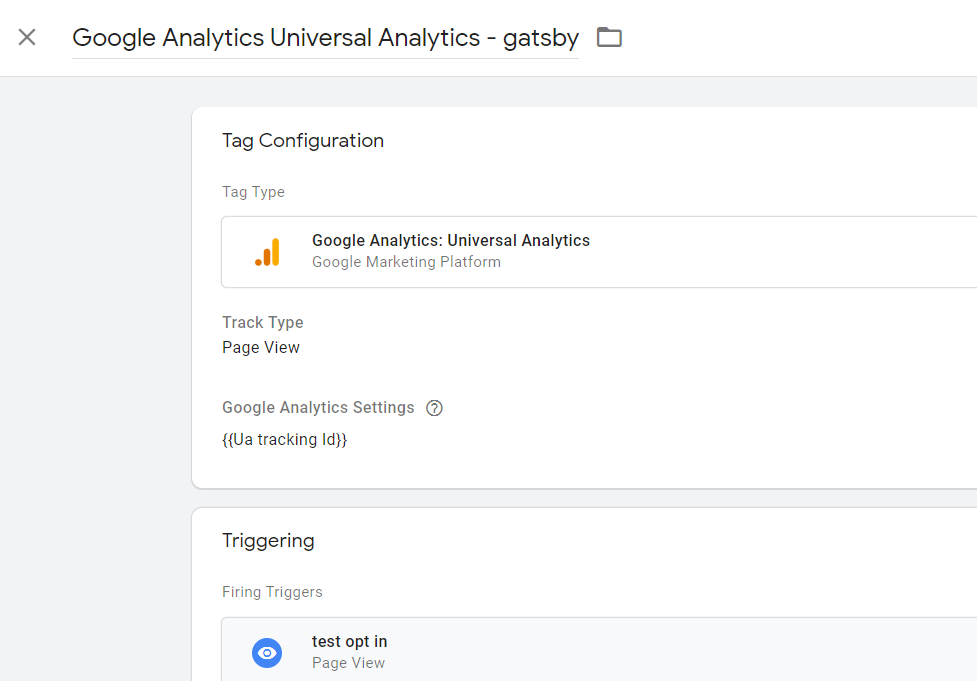
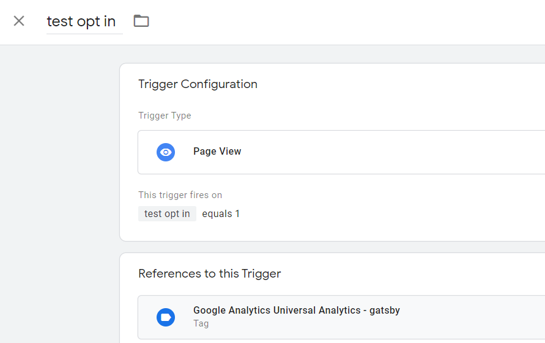
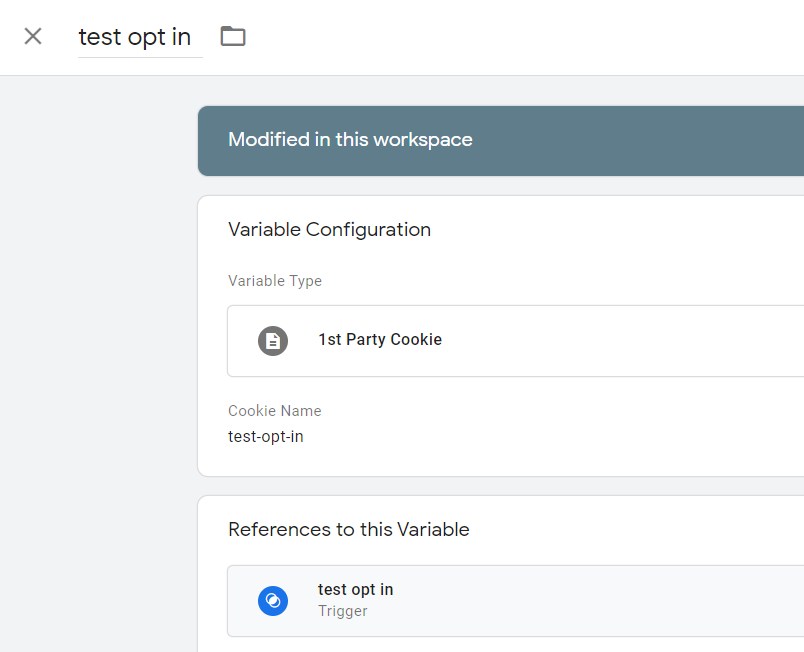
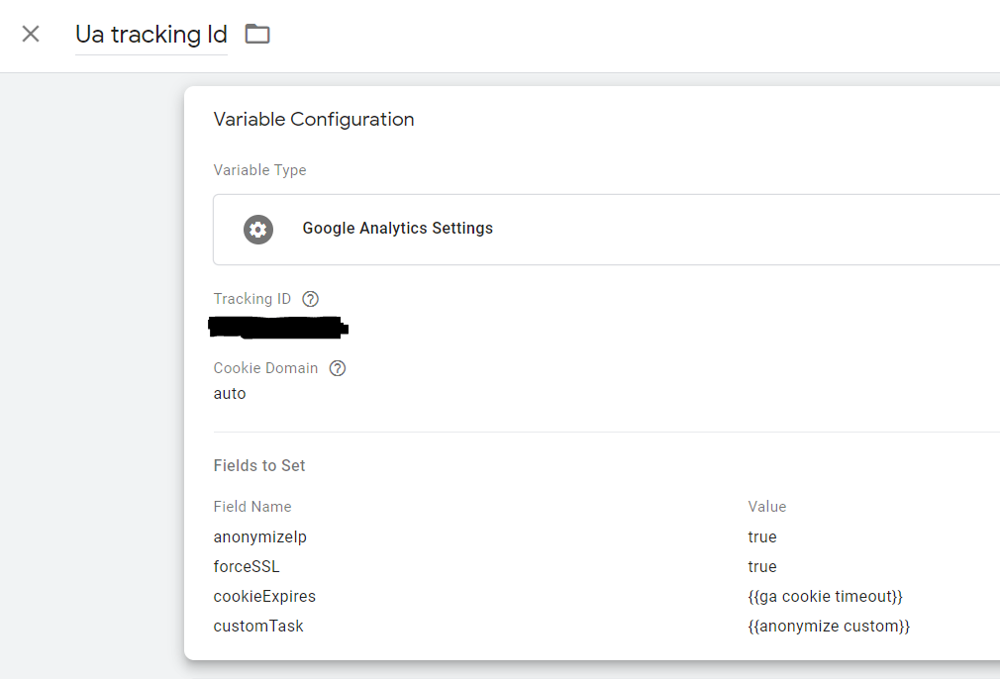

## Google Tag Manager configuration

To be fair this blog was never meant to reach a broad audience. Adding google analytics support was not on my shortlist of improvements to make to this site, but a colleague of mine was toying with Tag Manager for his site and was struggling to try to comply with EU regulations. His experiments raised my curiosity.
By nature a gatsby site is static and will not gather any personal information, therefore I guess the only required part to make the site compliant is a dedicated page informing the user that no personal information is collected.

Before trying to tweak anything, I had to set up Google analytics.
From what I have read the recommended way to include GA tags is to leverage Google Tag Manager. 

-The first benefit of this approach is not to expose your GA tracking Id. 
I think this is not a big deal nowadays, but being cautious does not hurt 😎

-The second benefit is that it gives the site admin a hook enabling him to tweak GA's behavior.


### Opt in strategy

For your site to be Gdpr compliant, you have to explicitly make the users accept that your site sends data to third-party services on a service by service basis.
The easiest solution I have found in Gtm to achieve that is to add a condition to the firing trigger of your GA Tag.

####The "Google Analytics Universal Analytics - gatsby" tag :




####The "Test Opt In" trigger :




####The variable whose value has been retrieved from a first-party cookie :




### Anonymizing data

With this setup in place, would the site be able to let the user manage its preferences, a tiny problem would remain.

By default when enabled Google Analytics when enabled eagerly retrieves some PII aka personally identifiable information from the user's browsing your site. 
To abide by the EU regulations the website owners have to configure the GA Tags so that GA strips out from its reports all of these PII.

Google kindly provides some built-in features in GTM to help us with that. 
The variable used to configure the GA tag, for instance, can hold a field the GA script will evaluate to further anonymize the IP ( set it to true) 😎😎



Unfortunately, this is not enough and we have to populate some additional fields.
Those custom fields will hold some variables of the type "Custom javascript". They will be run before GA Tags sends the data it has collected, giving us the opportunity to :

-Limit the lifetime of GA cookies to 13 months.

```javascript
function(){
    try {
        var ga = {{cookie_ga}};
        var ga_create= (Number(ga.split(".").pop()))*1000;
        var sec_expire = 60*60*24*30*13*1000;
        var t = new Date().getTime();
        var t0 = new Date(ga_create).getTime();
        var t1 = t0 + sec_expire;
        var t_diff = Math.round((t1-t)/1000);
        return t_diff;
    } catch(e){
        return sec_expire/1000;
        console.log(e);
    }
}
```
-Strip out any other PII collected from forms for instance using Regex if need be.

To do that you can find on the internet a template and tweak it to your needs/locale
For the Erizo-Dev-Blog there is no form, so this script is only included for reference.

```javascript
function() {

    return function(model) {
        // PII to strip out
        var piiRegex = [{
            name: 'EMAIL',
            regex: /[^\/]{4}@[^\/]{4}/g
            },{
            name: 'TEL',
            regex: /((tel=)|(telephone=)|(phone=)|(mobile=)|(mob=))[\d\+\s][^&\/\?]+/gi
            },{
            name: 'NAME',
            regex: /((prenom=)|(nom=)|(firstname=)|(lastname=)|(surname=))[^&\/\?]+/gi
            }];
            var globalSendTaskName = '_' + model.get('trackingId') + '_sendHitTask';
        // Data that were to be sent
        var originalSendTask = window[globalSendTaskName] = window[globalSendTaskName] || model.get('sendHitTask');
        var i, hitPayload, parts, val;

            // sendHitTask will send the Data without the filtered PII
            model.set('sendHitTask', function(sendModel) {
            hitPayload = sendModel.get('hitPayload').split('&');
            for (i = 0; i < hitPayload.length; i++) {
                parts = hitPayload[i].split('=');
                // Double-decode, to account for web server encode + analytics.js encode
                val = decodeURIComponent(decodeURIComponent(parts[1]));
                piiRegex.forEach(function(pii) {
                // Replaces données PII par "REDACTED" (expurgés).
                val = val.replace(pii.regex, '[REDACTED ' + pii.name + ']'); 
            });
            parts[1] = encodeURIComponent(val);
            hitPayload[i] = parts.join('=');
            }
            sendModel.set('hitPayload', hitPayload.join('&'), true);
            // Sends data
            originalSendTask(sendModel); 
        });     
    };
}
```

I have taken the two samples from the [formation-analytics](https://www.formations-analytics.com/google-tag-manager-google-analytics-et-rgpd/) website which is unfortunately only available in french 🥖🥖.

In the upcoming [part-2](/gatsby-gdpr-compliance-part2) of this article, I will elaborate on how to handle the preferences and the opt-in cookie now required by our GTM.
